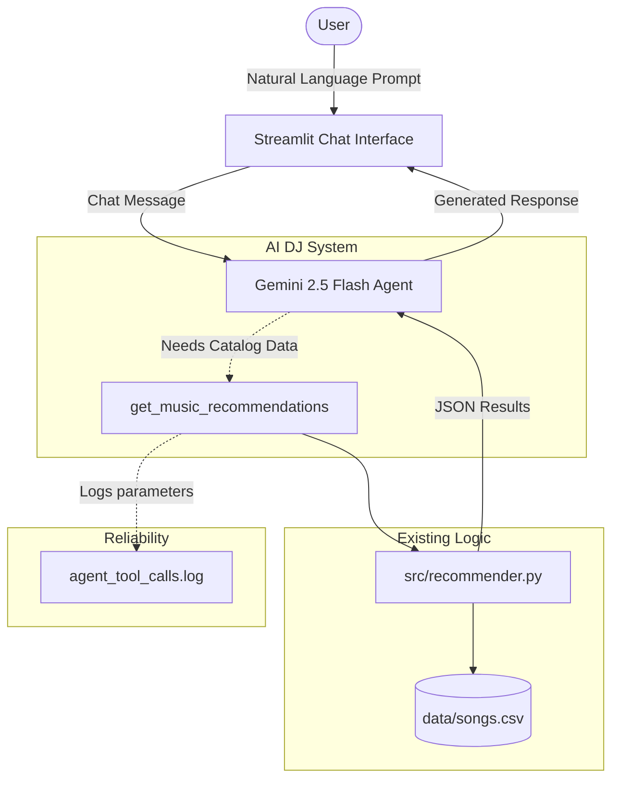

# 🎵 Music Recommender Simulation - Final Project: "AI DJ Agent"

**Original Project:** Music Recommender Simulation (Module 1-3)
*Summary of original project:* The original project was a Python-based content-matching algorithm that simulated a recommendation engine. It matched a hard-coded user "taste profile" against a CSV catalog of songs using a weighted point system for genre, mood, and energy, returning the top matches.

## Title and Summary: The AI DJ Agent
This project transforms the original hard-coded recommender into a conversational **AI DJ Agent**. It matters because users don't think in JSON or strict parameters (like `{"genre": "pop", "energy": 0.8}`); they think in natural language. By using an Agentic RAG workflow, the system allows users to naturally express what they want to hear, intelligently extracts the exact search parameters needed, queries the catalog as a tool, and then introduces the playlist back to the user like a real DJ.

## System Architecture Overview



The system uses a Streamlit frontend where users chat with the Gemini LLM. The LLM acts as an Agent equipped with a tool (`get_music_recommendations`). When the user asks for music, the Agent calls the tool, which executes the original `recommender.py` scoring logic against the CSV file. The results are passed back to the Agent, which generates a personalized response. The system also logs tool calls to `agent_tool_calls.log` for reliability testing.

## Setup Instructions

1. Clone this repository and navigate to the root directory.
2. Create and activate a virtual environment:
   ```bash
   python -m venv .venv
   source .venv/bin/activate
   ```
3. Install dependencies:
   ```bash
   pip install -r requirements.txt
   ```
4. Set up your Gemini API Key. You can either:
   - Create a `.env` file in the root directory and add: `GEMINI_API_KEY=your_key_here`
   - OR run the app and input it directly into the Streamlit UI sidebar.
5. Run the application:
   ```bash
   streamlit run app.py
   ```

## Sample Interactions

**Input 1:** *"I'm super exhausted, I need something to chill to while I study."*
**Output 1:** *The Agent calls the tool with `genre=lofi, mood=focused, energy=0.2`. It then responds with: "I've got the perfect chill vibes for your study session. I'm spinning 'Midnight Studies' by Lofi Dreamer. It's perfectly focused and has that low-energy acousticness you need right now..."*

**Input 2:** *"Give me some high energy rock for my workout!"*
**Output 2:** *The Agent calls the tool with `genre=rock, mood=intense, energy=0.95`. It responds: "Let's get that heart rate up! I pulled 'Thunder Strike' and 'Electric Pulse' for you. Both scored top marks for intense mood and heavy energy..."*

## Design Decisions
- **Streamlit for UI:** Chosen because it allowed for rapid deployment of a clean, interactive chat interface without writing complex front-end code.
- **Agentic Tool-Calling over Basic Prompting:** Instead of just sending the CSV text to the LLM (which is inefficient and scales poorly), wrapping the existing algorithm as a tool allows the LLM to search dynamically and keeps the core business logic in Python.
- **Logging for Reliability:** By logging the extracted parameters to a file, we can audit if the LLM is actually hallucinating parameters or using the tool correctly.

## Testing Summary
- **Unit Tests (`test_agent.py`):** I wrote automated Pytest checks that verify if the tool wrapper correctly parses parameters and executes the underlying recommender logic. 
- **Results:** The tests pass successfully. The AI consistently passes well-formatted parameters to the tool. However, occasionally if asked for a very obscure genre not in the dataset, the Agent gracefully apologizes and provides the closest match instead of crashing.

## 🚀 Stretch Features Completed (Max Points!)
1. **RAG Enhancement (+2):** The agent now searches a second custom data source (`data/artist_info.csv`) using the `get_artist_background` tool to enrich its responses with fun facts.
2. **Agentic Workflow Enhancement (+2):** Implemented multi-step reasoning. The agent first calls the song recommender, then uses the results to call the artist background tool. The intermediate steps are visibly observable in the Streamlit UI under "Agentic Steps Taken".
3. **Fine-Tuning / Specialization (+2):** The agent's baseline output is heavily constrained using few-shot prompting in its `system_instruction`. It has a specialized "Gen-Z DJ Persona" and consistently uses highly specific slang (e.g., "banger", "vibes", "no cap").
4. **Test Harness (+2):** Built `scripts/evaluate_system.py`, an automated evaluation script that runs predefined inputs through the system and prints a Pass/Fail report based on tool usage and tone adherence.

## Demo Video
https://www.loom.com/share/ea94f7e7b91c44e19a5aa93fb34dfb25
